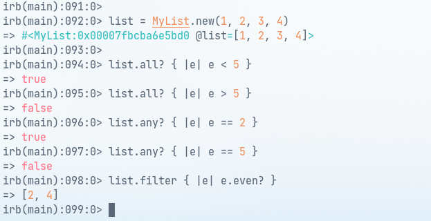

# Ruby Enumerables

> Ruby program that uses enumerables.

## Getting Started

Make sure you have Ruby installed by typing `ruby -v` in your terminal.

If you don't have ruby installed, you can install it with one of the following methods:

- In MacOS: `brew install ruby`,
- In Linux: `sudo apt-get install ruby`,
- In Windows: `https://www.rubyinstaller.org/downloads/`
  In Windows: `ruby -v`

## Authors

👤 **Andres Condezo**

| &nbsp;       | &nbsp;                                                        |
| ------------ | ------------------------------------------------------------- |
| **GitHub**   | [@Andres Condezo](https://github.com/andres-condezo)          |
| **LinkedIn** | [andres-condezo](https://www.linkedin.com/in/andres-condezo/) |

👤 **Leonardo Albornoz**

| &nbsp;       | &nbsp;                                           |
| ------------ | ------------------------------------------------ |
| **GitHub**   | [@Leboroz](https://github.com/Leboroz)           |
| **Twitter**  | [@Leboroz](https://twitter.com/leboroz)          |
| **LinkedIn** | [@Leboroz](https://www.linkedin.com/in/leboroz/) |

👤 **Fabrizio Garcia**

| &nbsp;       | &nbsp;                                               |
| ------------ | ---------------------------------------------------- |
| **GitHub**   | [@fabgrel10](https://github.com/fabgrel10)           |
| **Twitter**  | [@fabgrel10](https://twitter.com/fabgrel10)          |
| **LinkedIn** | [@fabgrel10](https://www.linkedin.com/in/fabgrel10/) |

## 🤝 Contributing

Contributions, issues, and feature requests are welcome!

Feel free to check the [issues page](../../issues/).

## Show your support

Give a ⭐️ if you like this project!

## Acknowledgments

- [Ruby docs](https://ruby-doc.org/core-3.0.0/Enumerable.html#method-i-sort)

## 📝 License

This project is [MIT](./MIT.md) licensed.
